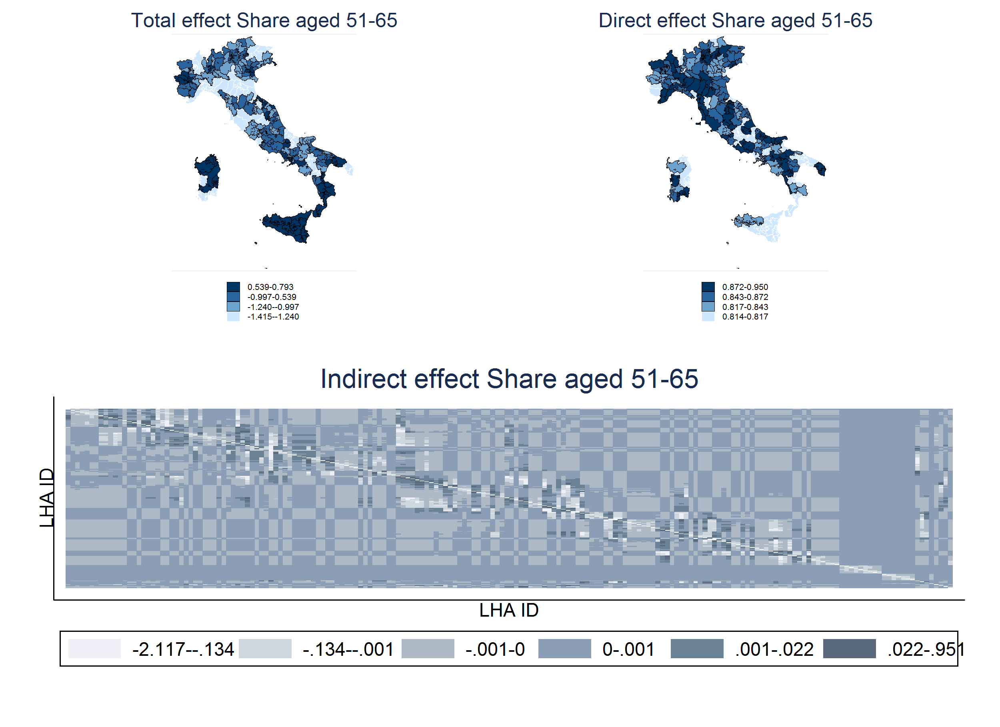

---

##### Download

+ [Paper](paper1.pdf)


---

##### Abstract

Over the last decades spatial econometric models have represented a common tool for measuring spillover effects across different geographical entities (counties, provinces, regions or nations). The aim of this paper is to investigate the issue of measuring spatial spillovers in the presence of institutional constraints that can be geographically defined. In these cases, assuming that spatial effects are not affected by the institutional setting may produce biased estimates due to the composition of two distinct sources of spatial dependence. Our approach is based on redefining the contiguity structure so as to account for the institutional constraints using two different contiguity matrices: the within matrix, which defines contiguity among units obeying the same institutional setting, and the between matrix, which traces spatial linkages among contiguous units across different jurisdictions. This approach allows to disentangle the two sources of spatial correlation and to easily test for the existence of binding institutional constraints. From the econometric perspective, we extend Lacombe (2004) approach to incorporate the aforementioned institutional constraints in a spatial Durbin model with individual specific slopes, while inference is conducted using a two-way cluster robust variance–covariance matrix controlling for both spatial and time correlations. We apply this methodology to analyze spatial dependence of per-capita public health expenditures in Italyat Local Health Authority level using a balanced panel dataset from 2001 to 2005. Our results show robust evidence of a significant and positive spatial coefficient for the within effect, while the between effect, although significant, is very close to zero, thus confirming the importance and validity of the proposed approach.

---

##### Total, direct and indirect spatial effect partition



---

##### Citation

Vincenzo, A., Belotti, F., Depalo, D. & Piano Mortari, A. "Measuring spatial effects in the presence of institutional constraints: The case of Italian Local Health Authority expenditure", *Regional Science and Urban Economics*, Volume 49, 2014, https://doi.org/10.1016/j.regsciurbeco.2014.07.007.

```BibTeX
@article{atella_measuring_2014,
author = {Atella, V. and Belotti, F. and Depalo, D. and {Piano Mortari}, A.},
doi = {10.1016/j.regsciurbeco.2014.07.007},
journal = {Regional Science and Urban Economics},
pages = {232--241},
title ={Measuring spatial effects in the presence of institutional constraints: {The} case of {Italian} {Local} {Health} {Authority} expenditure},
volume = {49},
year = {2014}}
```
