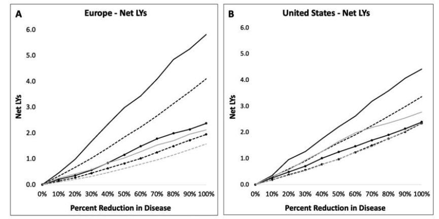

---

##### Download

+ [Paper](paper10.pdf)

---

##### Abstract

Since the 1950s, life expectancy in Europe and the United States has improved at a steady pace, driven mostly by gains at older ages. However, these lives are punctuated by more chronic disease than ever before, contributing to substantial morbidity and disability. Using the Future Elderly Model, we simulate longevity and disability over the remaining lifetime for cohorts of older Europeans and Americans. We see that investment in both treatment and prevention for cancer, diabetes, and heart disease show tremendous promise for breaking Europe and the United States out of the expensive equilibrium we now find ourselves in as a result of demographic gains.

---

##### Gains in mean life-years from older-age prevalence reduction among the prevalent and incidence reduction among the incident



---

##### Citation

Yu, J., Tysinger, B., Piano Mortari, A., Belotti, F., Ryan, M., Atella, V., Goldman, D. "The Returns to Preventing Chronic Disease in Europe and the United States". *Journal of Human Capital*. Volume 16, Issue 1, 2022. https://www.journals.uchicago.edu/doi/10.1086/718513

```BibTeX
@article{doi:10.1086/718513,
	author = {Yu, Jeffrey C. and Tysinger, Bryan C. and {Piano Mortari}, Andrea and Belotti, Federico and Ryan, Martha and Atella, Vincenzo and Goldman, Dana P.},
	journal = {Journal of Human Capital},
	number = {1},
	pages = {157-182},
	title = {The Returns to Preventing Chronic Disease in Europe and the United States},
	volume = {16},
	year = {2022}}


```


---
