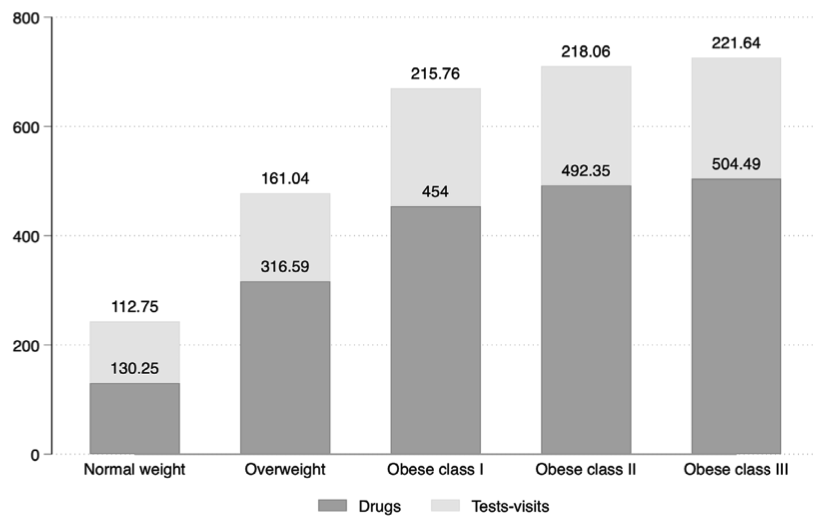

---

##### Download

+ [Paper](paper11.pdf)

---

##### Abstract

The study is based on a representative national sample of adults, with data obtained from electronic clinical records of 900 Italian general practitioners. Data relative to the year 2018 were analyzed. The study population was classified according to BMI (normal weight, overweight, and obesity classes 1, 2, and 3) and glucose metabolism status (normoglycemia – NGT; impaired fasting glucose – IFG; diabetes mellitus – DM). Outpatient health expenditures include diagnostic tests, specialist visits, and drugs. Data relative to 991,917 adults were analyzed. Annual per capita expenditure rose from 252.2 Euro among individuals with normal weight to 752.9 Euro among those with class 3 obesity. The presence of obesity determined an excess cost, particularly among younger individuals. Within each BMI class, the presence of IFG or DM2 identified subgroups of individuals with substantially higher healthcare expenditures.

---

##### Average healthcare outpatient expenditure by BMI classes



---

##### Citation

Atella, V., Belotti, F., Cricelli, C., Giaccherini, M., Medea, G., Nicolucci, A., Piano Mortari, A., Sbraccia, P. "Outpatient healthcare costs associated with overweight and obesity in Italy". *BMC Health Services Research*. Volume 23, Issue 1, 2022. https://bmchealthservres.biomedcentral.com/articles/10.1186/s12913-023-09576-4

```BibTeX
@article{Atella:2023aa,
	author = {Atella, Vincenzo and Belotti, Federico and Cricelli, Claudio and Giaccherini, Matilde and Medea, Gerardo and Nicolucci, Antonio and {Piano Mortari}, Andrea and Sbraccia, Paolo},
	journal = {BMC Health Services Research},
	number = {1},
	pages = {619},
	title = {Outpatient healthcare costs associated with overweight and obesity in Italy},
	volume = {23},
	year = {2023}}
```


---
