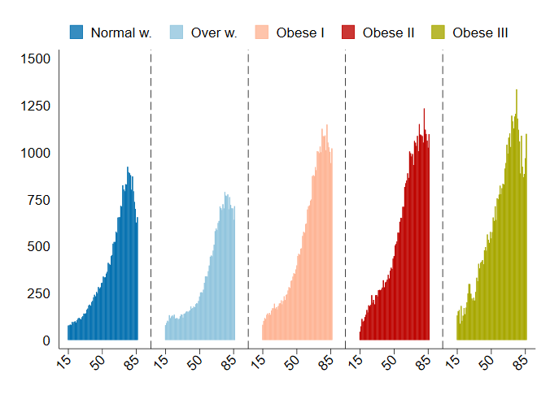

---

##### Download

+ [Paper](paper12.pdf)

---

##### Abstract

In this paper we simulate BMI lifetime profile costs based on longitudinal electronic clinical data on a large representative sample of the Italian population. In particular, we simulate how patients belonging to different BMI classes (normo-weight, overweight, and obese (I, II, and III)) generate different lifetime cost profiles within the primary care setting. Our findings show that compared to normo-weight patients, the obese generate the largest cost differential over the entire life cycle, while the overweight spends less than the normo-weight, mainly because of savings generated starting from early middle age onward. According to the OECD projections, a steady increase in obesity rates is estimated until at least 2030, with a significant economic impact. Our estimate could represent an important reference for policymakers to prioritize public interventions against the obesity pandemic.

---

##### Average healthcare outpatient expenditure by BMI classes



---

##### Citation

Atella, V., Belotti, F., Giaccherini, M., Medea, G., Nicolucci, A., Piano Mortari, A., Sbraccia, P. "Lifetime costs of overweight and obesity in Italy". *Economics and Human Biology*. 2024. https://doi.org/10.1016/j.ehb.2024.101366


```BibTeX
@article{Atella:2024aa,
	author = {Atella, Vincenzo and Belotti, Federico and Giaccherini, Matilde and Medea, Gerardo and Nicolucci, Antonio and {Piano Mortari}, Andrea and Sbraccia, Paolo},
	journal = {Economics and Human Biology},
	number = {},
	pages = {},
	title = {Lifetime costs of overweight and obesity in Italy},
	volume = {},
	year = {2024}}
```


---
