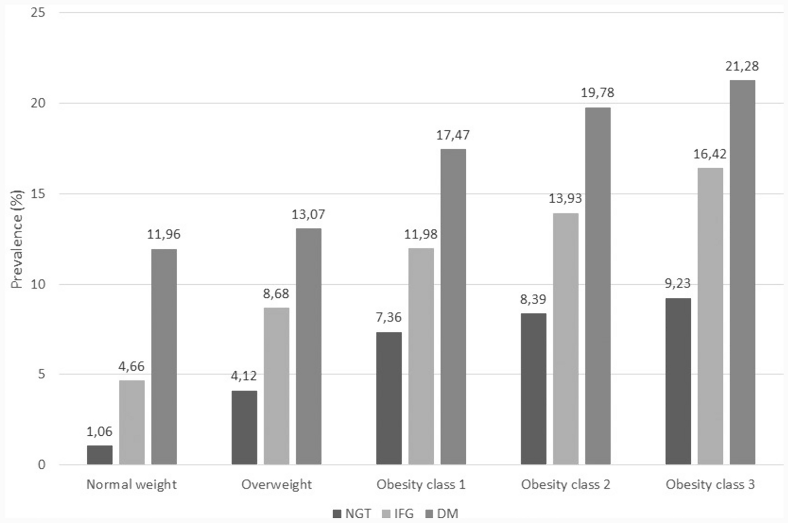

---

##### Download

+ [Paper](paper13.pdf)

---

##### Abstract

The study is based on data from the Health Search/IQVIA Health LPD Longitudinal Patient Database, an Italian general practice registry, with data obtained from electronic clinical records of 800 general practitioners throughout Italy. Data relative to the year 2018 were analyzed. The study population was classified according to BMI (normal weight, overweight, and obesity classes 1, 2 and 3) and glucose metabolism status (normoglycemia—NGT; impaired fasting glucose—IFG; diabetes mellitus—DM). Comorbidities were identified through ICD-9 CM codes.
Data relative to 991,917 adults were analyzed. The prevalence of overweight was 39.4%, while the prevalence of obesity was 11.1% (class 1: 7.9%, class 2: 2.3%, class 3: 0.9%). In the whole population, the prevalence of DM and IFG was 8.9% and 4.2%, respectively. Both overweight and obesity were associated with an increasing prevalence of glucose metabolism alterations and a large array of different chronic conditions, including cardio-cerebrovascular diseases, heart failure, chronic kidney disease, osteoarticular diseases, depression, sleep apnea, and neoplasms of the gastrointestinal tract. Within each BMI class, the presence of IFG, and to a greater extent DM, identified subgroups of individuals with a marked increase in the risk of concomitant chronic conditions.

---

##### Prevalence of heart failure by BMI and glucose metabolism classes



---

##### Citation

Atella, V., Belotti, F., Giaccherini, M., Medea, G., Nicolucci, A., Piano Mortari, A., Sbraccia, P. "The interplay between excess weight and hyper-glycemia on NCDs in Italy: results from a cross-sectional study". *Acta Diabetologica*. 2024. https://doi.org/10.1007/s00592-024-02296-z


```BibTeX
@article{Atella:2024ab,
	author = {Atella, Vincenzo and Belotti, Federico and Giaccherini, Matilde and Medea, Gerardo and Nicolucci, Antonio and {Piano Mortari}, Andrea and Sbraccia, Paolo},
	journal = {Acta Diabetologica},
	number = {},
	pages = {},
	title = {The interplay between excess weight and hyper-glycemia on NCDs in Italy: results from a cross-sectional study},
	volume = {},
	year = {2024}}
```


---
