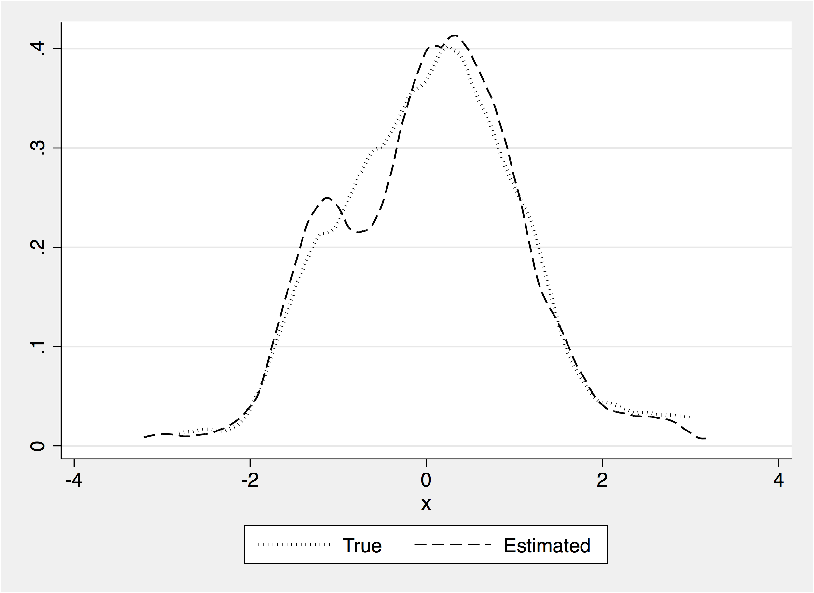

---

##### Download

+ [Paper](paper2.pdf)
+ [Code and data](https://Andreapm1977.github.io)

---

##### Abstract

_xsmle_ is a new user-written command for spatial analysis. We consider the quasi–maximum likelihood estimation of a wide set of both fixed- and random-effects spatial models for balanced panel data. _xsmle_ allows users to handle unbalanced panels using its full compatibility with the
_mi_ suite of commands, use spatial weight matrices in the form of both Stata matrices and _xsmle_ objects, compute direct, indirect, and total marginal effects and related standard errors for linear (in variables) specifications, and exploit a wide range of postestimation features, including the panel-data case predictors of Kelejian and Prucha (2007, _Regional Science and Urban Economics_ 37: 363–374). Moreover, _xsmle_ allows the use of _margins_ to compute total marginal effects in the presence of nonlinear specifications obtained using factor variables. In this article, we describe the command and all of its functionalities using simulated and real data.

---

##### xsmle postestimation: predicted FE



---

##### Citation

Belotti, F., Hughes, G., & Piano Mortari, A. (2017). "Spatial Panel-data Models Using Stata". *The Stata Journal*, 17(1), 139-180. https://doi.org/10.1177/1536867X1701700109

```BibTeX
@article{sj_2017,
	author = {Belotti, F. and Hughes, G. and {Piano Mortari}, A.},
	journal = {The Stata Journal},
	number = {1},
	pages = {139-180},
	title = {Spatial panel data models using Stata},
	volume = {17},
	year = 2017}
```


---

##### Related material

+ [Presentation slides](presentation2.pdf)
