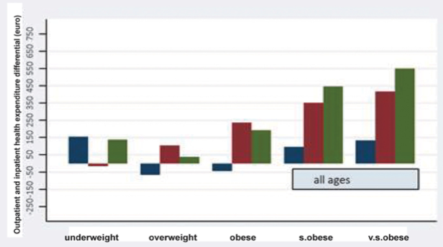

---

##### Download

+ [Paper](paper3.pdf)

---

##### Abstract

Aging and excessive adiposity are both associated with an increased risk of developing multiple chronic diseases, which drive ever increasing health costs. The main aim of this study was to determine the net (non‐estimated) health costs of excessive adiposity and associated age‐related chronic diseases. We used a prevalence‐based approach that combines accurate data from the Health Search CSD‐LPD, an observational dataset with patient records collected by Italian general practitioners and up‐to‐date health care expenditures data from the SiSSI Project. In this very large study, 557,145 men and women older than 18 years were observed at different points in time between 2004 and 2010. The proportion of younger and older adults reporting no chronic disease decreased with increasing BMI. After adjustment for age, sex, geographic residence, and GPs heterogeneity, a strong J‐shaped association was found between BMI and total health care costs, more pronounced in middle‐aged and older adults. Relative to normal weight, in the 45‐64 age group, the per‐capita total cost was 10% higher in overweight individuals, and 27 to 68% greater in patients with obesity and very severe obesity, respectively. The association between BMI and diabetes, hypertension and cardiovascular disease largely explained these elevated costs.

---

##### Inpatient and outpatient costs differentials wrt normal weight



---

##### Citation

Atella, V., Kopinska, J., Medea, G., Belotti, F., Tosti, V., Piano Mortari, A., Cricelli, C. & Fontana, L. "Excess body weight increases the burden of age-associated chronic diseases and their associated health care expenditures". *Aging* (Albany NY). 2015 Oct 29; 7:882-892 . https://doi.org/10.18632/aging.100833

```BibTeX
@article{IMA:IMA2,
	author = {Atella, V. and Kopinska, J. and Medea, G. and Belotti, F. and Tosti, V. and Piano Mortari, A. and Cricelli, C. and Fontana, L.},
	journal = {Aging},
	number = {10},
	pages = {882-892},
	title = {Excess body weight increases the burden of age-associated chronic diseases and their associated health care expenditures},
	volume = {7},
	year = {2015}}
```


---
