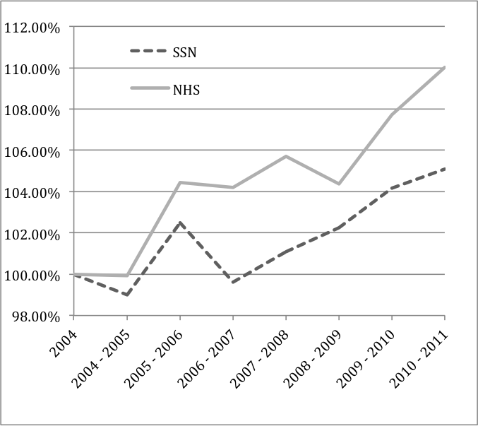

---

##### Download

+ [Paper](paper4.pdf)

---

##### Abstract

The English (NHS) and the Italian (SSN) healthcare systems share many similar features: basic founding principles, financing, organization, management, and size. Yet the two systems have faced diverging policy objectives since 2000, which may have affected differently healthcare sector productivity in the two countries. In order to understand how different healthcare policies shape the productivity of the systems, we assess, using the same methodology, the productivity growth of the English and Italian healthcare systems over the period from 2004 to 2011. Productivity growth is measured as the rate of change in outputs over the rate of change in inputs. We find that the overall NHS productivity growth index increased by 10% over the whole period, at an average of 1.39% per year, while SSN productivity increased overall by 5%, at an average of 0.73% per year. Our results suggest that different policy objectives are reflected in differential growth rates for the two countries. In England, the NHS focused on increasing activity, reducing waiting times and improving quality. Italy focused more on cost containment and rationalized provision, in the hope that this would reduce unjustified and inappropriate provision of services.

---

##### Productivity index growth



---

##### Citation

Atella, V., Belotti, F., Bojke, C., Castelli, A., Grasic, K., Kopinska, J., Piano Mortari, A., Street, A. "How health policy shapes healthcare sector productivity? Evidence from Italy and UK". *Health Policy*. Volume 123, Issue 1, 2019, Pages 27-36. https://doi.org/10.1016/j.healthpol.2018.10.016

```BibTeX
@article{atella_how_2019,
	author = {Atella, Vincenzo and Belotti, Federico and Bojke, Chris and Castelli, Adriana and Gra{\v s}i{\v c}, Katja and Kopinska, Joanna and Piano Mortari, Andrea and Street, Andrew},
	date = {2019-01},
	doi = {10.1016/j.healthpol.2018.10.016},
	journaltitle = {Health Policy},
	number = {1},
	pages = {27--36},
	title = {How health policy shapes healthcare sector productivity? Evidence from Italy and UK},
	url = {https://linkinghub.elsevier.com/retrieve/pii/S0168851018306353},
	volume = {123}}
```


---
