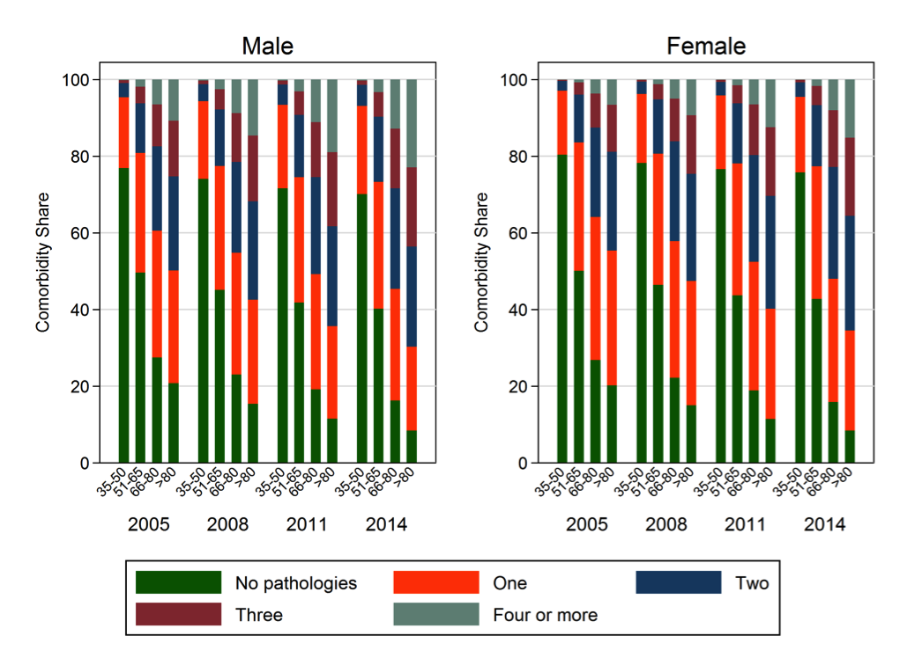

---

##### Download

+ [Paper](paper5.pdf)

---

##### Abstract

Aging is a strong risk factor for many chronic diseases. However, the impact of an aging population on the prevalence of chronic diseases and related healthcare costs are not known. We used a prevalence‐based approach that combines accurate clinical and drug prescription data from Health Search CSD‐LPD. This is a longitudinal observational data set containing computer‐based patient records collected by Italian general practitioners (GP) and up‐to‐date healthcare expenditures data from the SiSSI Project. The analysis is based on data collected by 900 GP on an unbalanced sample of more than 1 million patients aged 35+, observed in different time periods between 2005 and 2014. In 2014, 86% of the Italian adults older than 65 had at least one chronic condition, and 56.7% had two or more. Prevalence of multiple chronic diseases and healthcare utilization increased among older and younger adults between 2004 and 2014. Indeed, in the last 10 years, average number of prescriptions increased by approximately 26%, while laboratory and diagnostic tests by 27%. The average number of DDD prescribed increased with age in all the observed years (from 114 in 2005 to 119.9 in 2014 for the 35–50 age group and from 774.9 to 1,178.1 for the 81+ patients). The alarming rising trends in the prevalence of chronic disease and associated healthcare costs in Italy, as well as in many other developed countries, call for an urgent implementation of interventions that prevent or slow the accumulation of metabolic and molecular damage associated with multiple chronic disease.

---

##### Comorbidity share



---

##### Citation

Atella, V., Piano Mortari, A., Kopinska, J., Belotti, F., Lapi, F., Cricelli, C., Fontana, L. "Trends in age‐related disease burden and healthcare utilization". *Aging Cell*. Volume 18, Issue 1, 2019. https://doi.org/10.1111/acel.12861

```BibTeX
@article{Atella:2019aa,
	author = {Atella, Vincenzo and {Piano Mortari}, Andrea and Kopinska, Joanna and Belotti, Federico and Lapi, Francesco and Cricelli, Claudio and Fontana, Luigi},
	doi = {10.1111/acel.12861},
	journal = {Aging Cell},
	title = {Trends in age-related disease burden and healthcare utilization.},
	volume = {18},
	year = {2019}}
```


---
