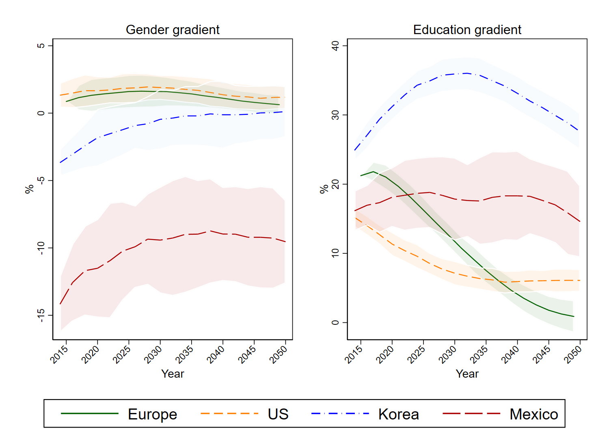

---

##### Download

+ [Paper](paper6.pdf)

---

##### Abstract

The aging process in OECD countries calls for a better understanding of the future disease prevalence, life expectancy (LE) and patterns of inequalities in health outcomes. In this paper we present the results obtained from several dynamic microsimulation models of the Future Elderly Model family for 12 OECD countries, with the aim of reproducing for the first time comparable long‐term projections in individual health status across OECD countries. We provide projections of LE and prevalence of major chronic conditions and disabilities, overall, by gender and by education. We find that the prevalence of main chronic conditions in Europe is catching‐up with the United States and significant heterogeneity in the evolution of gender and educational gradients. Our findings represent a contribution to support policymakers in designing and implementing effective interventions in the healthcare sector.

---

##### Population with 1 or more chronic condition



---

##### Citation

Atella, V., Belotti, F., Goldman, D., Gracner, T., Piano Mortari, A., Tysinger, B. "The future of the elderly population health status: Filling a knowledge gap". *Health Economics*. Volume 30, Issue S1, 2021. https://onlinelibrary.wiley.com/doi/10.1002/hec.4258

```BibTeX
@article{Atella_2021,
	author = {Atella, Vincenzo and Belotti, Federico and Kim, Daejung and Goldman, Dana and Gracner, Tadeja and {Piano Mortari}, Andrea and Tysinger, Bryan},
	journal = {Health Economics},
	number = {S1},
	pages = {11-29},
	title = {The future of the elderly population health status: Filling a knowledge gap},
	volume = {30},
	year = {2021}}
```


---
