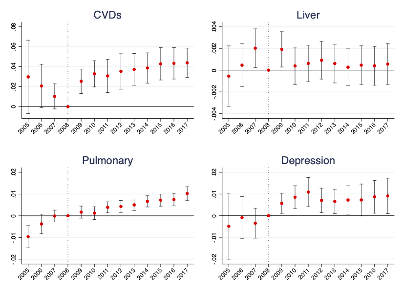

---

##### Download

+ [Paper](paper7.pdf)

---

##### Abstract

We investigate the impact of the Great Recession in Italy on the incidence of chronic diseases using new individual longitudinal data from Electronic Health Records. We exploit the exogenous shock in the economic conditions occurred in 2008 to estimate heterogeneous effects of an unprecedented rise in local unemployment rates in an individual fixed-effects model. Our results document that harsh economic downturns have a negative long-lasting effect on cardiovascular disease and a temporary effect on depression. This effect is heterogeneous across gender, increases with age and is stronger right before the retirement age. An important policy recommendation emerging from this study is that prolonged economic downturns constitute an additional external risk for individual health and not a temporary benefit.

---

##### Effects of unemployment shock on chronic conditions



---

##### Citation

Belotti, F., Kopinska, J., Palma, A., Piano Mortari, A. "Health status and the Great Recession. Evidence from electronic health records". *Health Economics*. Volume 31, Issue 8, 2022. https://onlinelibrary.wiley.com/doi/10.1002/hec.4551

```BibTeX
@article{crisis_hec,
	author = {Belotti, Federico and Kopinska, Joanna and Palma, Alessandro and Piano Mortari, Andrea},
	journal = {Health Economics},
	number = {8},
	pages = {1770-1799},
	title = {Health status and the Great Recession. Evidence from electronic health records},
	volume = {31},
	year = {2022}}
```


---
