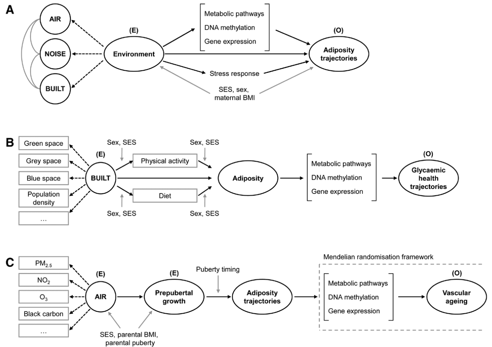

---

##### Download

+ [Paper](paper8.pdf)

---

##### Abstract

The current epidemics of cardiovascular and metabolic noncommunicable diseases have emerged alongside dramatic modifications in lifestyle and living environments. These correspond to changes in our “modern” postwar societies globally characterized by rural-to-urban migration, modernization of agricultural practices, and transportation, climate change, and aging. Evidence suggests that these changes are related to each other, although the social and biological mechanisms as well as their interactions have yet to be uncovered. LongITools, as one of the 9 projects included in the European Human Exposome Network, will tackle this environmental health equation linking multidimensional environmental exposures to the occurrence of cardiovascular and metabolic noncommunicable diseases.

---

##### Possible pathways from environment to health outcomes



---

##### Citation

Ronkainen, J., Nedelec, R., Sebert, S.,  on behalf of the LongITools Project Group. "LongITools: Dynamic longitudinal exposome trajectories in cardiovascular and metabolic noncommunicable diseases". *Environmental Epidemiology*. Volume 6, Issue 1, 2022. https://journals.lww.com/10.1097/EE9.0000000000000184

```BibTeX
@article{Ronkainen:2022aa,
	author = {Ronkainen, Justiina and Nedelec, Rozenn and Atehortua, Angelica and Balkhiyarova, Zhanna and Cascarano, Anna and Ngoc Dang, Vien and Elhakeem, Ahmed and van Enckevort, Esther and Goncalves Soares, Ana and Haakma, Sido and Halonen, Miia and Heil, Katharina F. and Heiskala, Anni and Hyde, Eleanor and Jacquemin, B{\'e}n{\'e}dicte and Keikkala, Elina and Kerckhoffs, Jules and Kl{\aa}vus, Anton and Kopinska, Joanna A. and Lepeule, Johanna and Marazzi, Francesca and Motoc, Irina and N{\"a}{\"a}t{\"a}nen, Mari and Ribbenstedt, Anton and Rundblad, Amanda and Savolainen, Otto and Simonetti, Valentina and de Toro Eadie, Nina and Tzala, Evangelia and Ulrich, Anna and Wright, Thomas and Zarei, Iman and d'Amico, Enrico and Belotti, Federico and Brunius, Carl and Castleton, Christopher and Charles, Marie-Aline and Gaillard, Romy and Hanhineva, Kati and Hoek, Gerard and Holven, Kirsten B. and Jaddoe, Vincent W. V. and Kaakinen, Marika A. and Kajantie, Eero and Kavousi, Maryam and Lakka, Timo and Matthews, Jason and Piano Mortari, Andrea and V{\"a}{\"a}r{\"a}sm{\"a}ki, Marja and Voortman, Trudy and Webster, Claire and Zins, Marie and Atella, Vincenzo and Bulgheroni, Maria and Chadeau-Hyam, Marc and Conti, Gabriella and Evans, Jayne and Felix, Janine F. and Heude, Barbara and J{\"a}rvelin, Marjo-Riitta and Kolehmainen, Marjukka and Landberg, Rikard and Lekadir, Karim and Parusso, Stefano and Prokopenko, Inga and de Rooij, Susanne R. and Roseboom, Tessa and Swertz, Morris and Timpson, Nicholas and Ulven, Stine M. and Vermeulen, Roel and Juola, Teija and Sebert, Sylvain and on behalf of the LongITools Project Group},
	journal = {Environmental Epidemiology},
	number = {1},
	title = {LongITools: Dynamic longitudinal exposome trajectories in cardiovascular and metabolic noncommunicable diseases},
	volume = {6},
	year = {2022}}
```


---
