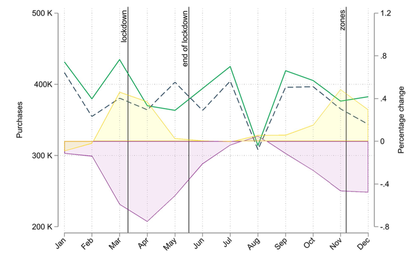

---

##### Download

+ [Paper](paper9.pdf)

---

##### Abstract

Recent literature on the mental health consequences of social distancing measures has found a substantial increase in self-reported sleep disorders, anxiety and depressive symptoms during lockdown periods. We investigate this issue with data on monthly purchases of psychotropic drugs from the universe of Italian pharmacies during the first wave of the COVID-19 pandemic and find that purchases of mental health-related drugs have increased with respect to 2019. However, the excess volumes do not match the massive increase in anxiety and depressive disorders found in survey-based studies. We also study the interplay between mobility, measured with anonymized mobile phone data, and mental health and report no significant effect of mobility restrictions on antidepressants and anxiolytics purchases during 2020. We provide three potential mechanisms that could drive the discrepancy between self-reported mental health surveys and psychotropic drugs prescription registries: (1) stockpiling practices in the early phases of the pandemic; (2) the adoption of compensatory behavior and (3) unexpressed and unmet needs due to both demand- and supply-side shortages in healthcare services.

---

##### Anxiolytic's purchases, mobility and mortality



---

##### Citation

Marazzi, F., Piano Mortari, A., Belotti, F., Carrà, S., Cattuto, C., Kopinska, J., Paolotti, D., Atella, V. "Psychotropic drug purchases during the COVID-19 pandemic in Italy and their relationship with mobility restrictions". *Scientific  Reports*. Volume 12, Issue 1, 2022. https://www.nature.com/articles/s41598-022-22085-4

```BibTeX
@article{10.1038/s41598-022-22085-4,
	author = {Marazzi, Francesca and {Piano Mortari}, Andrea and Belotti, Federico and Carr{\`a}, Giuseppe and Cattuto, Ciro and Kopinska, Joanna and Paolotti, Daniela and Atella, Vincenzo},
	journal = {Scientific Reports},
	number = {1},
	pages = {19336},
	title = {{Psychotropic drug purchases during the COVID-19 pandemic in Italy and their relationship with mobility restrictions}},
	volume = {12},
	year = {2022}}

```


---
