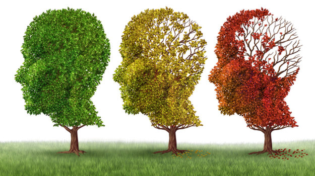

##### Description

The European Future Elderly Model is a highly capable tool that will increase its potential to address important, policy-relevant questions in Europe and (as a tool of comparison for) the United States. The development of an ADRD module in EUFEM will bridge the gap with the FEM and allow for comparable projections.These forecasts will take into account major factors expected to shape the future occurrence rates of ADRD, and provide an important contribution to scholarly research as well as public policy. The expansion of EUFEM to include additional data waves and countries will provide a step-change improvement, with the updated EUFEM capable of making re- liable predictions for 60 million Europeans aged 50 or more. Finally, the introduction of HCAP will allow researchers to analyze future scenarios using a robust econometric machinery for an accurate prediction of ADRD prevalence.

The EUFEM is a dynamic microsimulation model of European health and health dynamics at older ages. EUFEM is the European version of the FEM model, based on Harmonized version  of the SHARE data. Like the FEM, EUFEM accounts for competing risks over a full life horizon.
We plan on expanding the scope of EUFEM to include additional waves of SHARE (up to Wave 9) and additional countries not previously included in the development of EUFEM due to a shortage of data. Second, we will develop and validate an ADRD module in the EUFEM dynamic microsimulation model and obtain sound projections of the future prevalence of ADRD in Europe up to 2050. Moreover we will assess the burden of disease of ADRD in Europe using “what-if” scenarios. Finally, We will prepare the EUFEM microsimulation for the introduction of additional data, including additional HCAP waves, drawing on the HCAP survey collected in Europe for the first time in early-2022. 1The inclusion of HCAP will allow EUFEM to include discrete cognitive, behavioral and functional outcomes and model the effectiveness of disease-modifying therapies with greater nuance, similar to U.S. FEM.

#### Partipants

* **Tor Vergata University of Rome**
  * Andrea Piano Mortari (PI)
  * [Federico Belotti](https://fbelotti.github.io)
* **Masaryk University**
  * [Jakub Hlávka](https://sites.google.com/view/jakubhlavka/?pli=1)
  * [Stepan Mikula](https://sites.google.com/site/stepanmikula/)
  * [Michal Kvasnicka](https://www.muni.cz/en/people/847-michal-kvasnicka)
  * [Jaroslav Groero](https://www.groero.cz)

---
