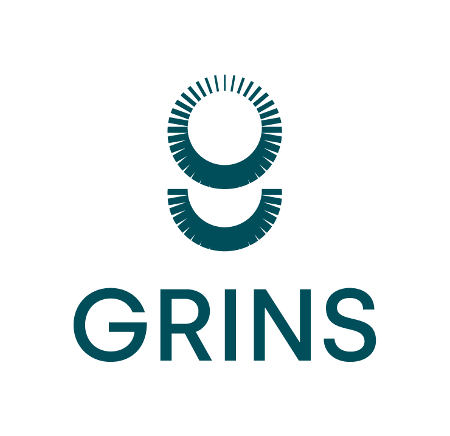

##### Description

In line with the general direction of the Recovery EU Plan, the Grins partnership will produce frontier research in the spectrum of economic-political-social sciences and data sciences, to provide evidence that will guide public policies, as well as the choices of citizens and companies in complex decision-making contexts, contributing to a more resilient, inclusive, and sustainable growth of the country. 

The heart of the Grins project is the design, development, and supply of the open data platform called AMELIA, a high-level technological tool that will first allow statistical analysis, and then the transfer of knowledge to the actors of the system, of many socio-economic, environmental, health, and financial dynamics of Italy, both at the local and national level.

---
