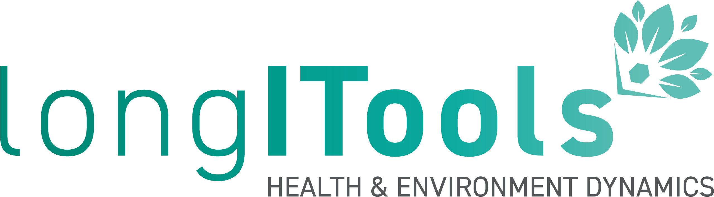

##### Description

Lifestyle and living environments have changed. Exposures to the environment such as air and noise pollution and the built environment, and an individual’s lifestyle, psychological and social situation, react with genetic factors leading to increased risk of developing diseases such as obesity, type 2 diabetes and cardiovascular diseases. The EU-funded [LONGITOOLS](https://longitools.org) project will study and measure how exposure to these environmental factors contribute to the risk of developing such diseases through a person’s life. The project will take an ‘exposome’ or holistic-based approach to determine the best points in life to intervene to reduce these risks, generating evidence for policy and designing innovative healthcare applications. LongITools is one of the nine projects in the [European Human Exposome Network](https://www.humanexposome.eu).

---

<iframe width="560" height="315" src="https://www.youtube.com/embed/jQaWPOQulNg?si=ID9sS-B1N0ao841V" title="YouTube video player" frameborder="0" allow="accelerometer; autoplay; clipboard-write; encrypted-media; gyroscope; picture-in-picture; web-share" allowfullscreen></iframe>
