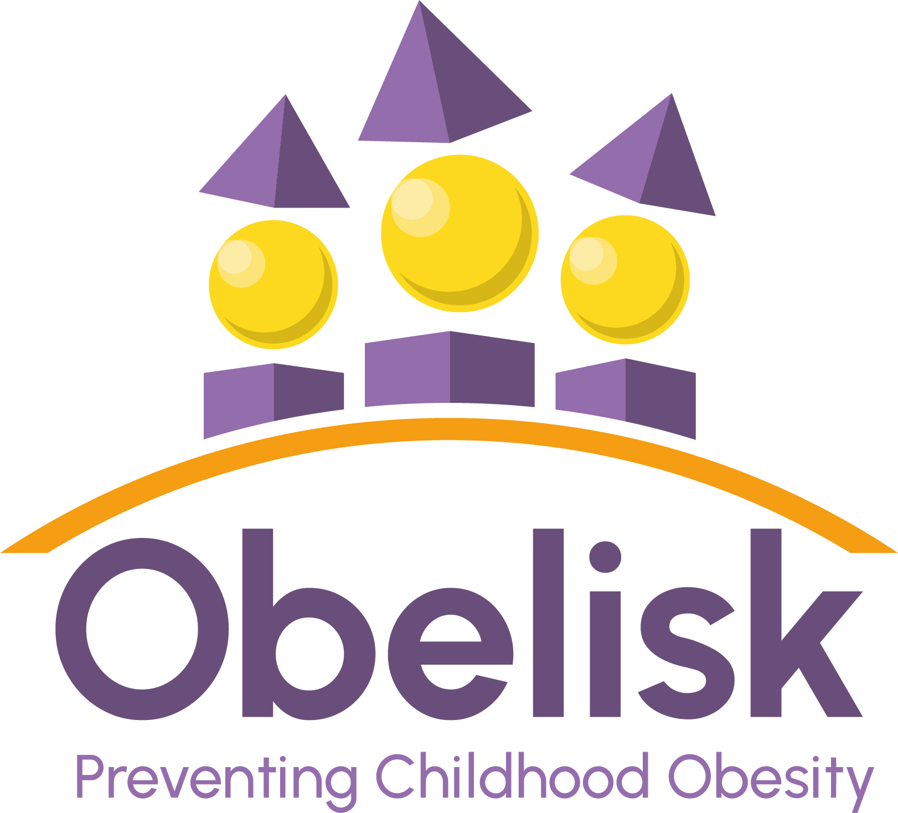

##### Description

Rates of childhood obesity are increasing at an alarming rate. According to the WHO European Regional Obesity Report 2022, roughly 1 in 3 primary school-aged children in Europe is living with obesity or overweight. This figure is predicted to rise even further. Children and teenagers with obesity and overweight carry an increased risk of developing poor health outcomes in later life including severe obesity, diabetes and cardiovascular disease leading to disability and premature death.

Treating adults with obesity and overweight is challenging and it is proven that both prevention and treatment work better in younger age groups. A new European project is embarking upon an ambitious research programme aimed at preventing childhood obesity to ‘cut the roots’ of the current pandemic. The OBELISK project has developed an approach built on four principles, hence reference to the four-sided structure we are all familiar with: Prediction, Prevention, Precision, and Participation.

OBELISK aims to deliver scientific breakthroughs to enhance our understanding of the molecular mechanisms by which causative factors interact to drive (or prevent) the transition from normal weight to obesity during childhood. This knowledge will be used to develop and exploit new predictive tools and preventative treatments. Research teams will also seek to identify new genes associated with childhood obesity, providing the opportunity to develop new drug treatments. The project will demonstrate the effectiveness of targeted approaches to prevent childhood obesity, including trialling new treatments to reverse obesity in children who have mutations, and are therefore predisposed to the early development of severe obesity. Finally, underpinning the entire project is a participatory approach to both the research and dissemination of the project results, including the roll out of educational programmes, through engaging with families and carers, day care providers and schools, local authorities, the healthcare industry as well as policymakers and the scientific and academic communities.

This ambitious project includes 15 partners from universities, research institutions and small and medium-sized enterprises from across nine European countries. The consortium has received 9.5 million Euro from the EU’s Horizon Europe Research and Innovation programme and an additional 1.7 million Euro from UK and Swiss research funding bodies. The project is coordinated by French research institute INSERM, led by the centre in Lille and the consortium have met today to initiate the project and embark upon their five-year collaboration.

---
