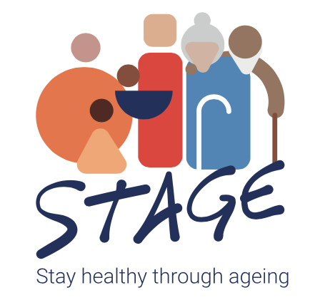

##### Description

By 2050, it is projected that the population aged 75 years and over will double in almost all European regions. This demographic projection presents important personal and societal challenges that require integrated and agile solutions. A person’s opportunity to stay healthy through ageing depends on their capacity to function in everyday life in a rapidly changing society. We advocate that this can be promoted from as early as possible and/or actively corrected by personalised prevention. However, to address the gaps in scientific evidence and the multiple ethical, societal and structural barriers which exist, researchers need to work together with policymakers and citizens of all ages.

One way of addressing these challenges is to gain a deeper understanding of people's diverse living environments, social stressors, and the biology of ageing. Adopting a life-course and digital-based approach, the project will generate bio-psychosocial models and AI-assisted, age-friendly tools, to detect, prevent and reduce the risk of ageing with multi-morbidity. The project team will design solutions for person-centred health and care services that focus on specific periods of life and are needs-based. These solutions will be co-designed with citizens, patients, healthcare providers, and policymakers, and include:
• Running cohort-based clinical studies, and
• Developing a Europe-wide digital, interactive, healthy ageing atlas to inform policymaking and strategic urban development for age-friendly neighbourhoods.

This highly ambitious project includes 22 partners, from research institutions, small and medium-sized enterprises, and an NGO, across 11 countries, with expertise in ethics and healthcare systems, environments and participatory science, life-course epidemiology, economics, molecular ageing, trustworthy artificial intelligence, integrated systems design, life-course based interventions, FAIR data management, nursing and healthcare, patient advocacy, and communication and knowledge management

---
